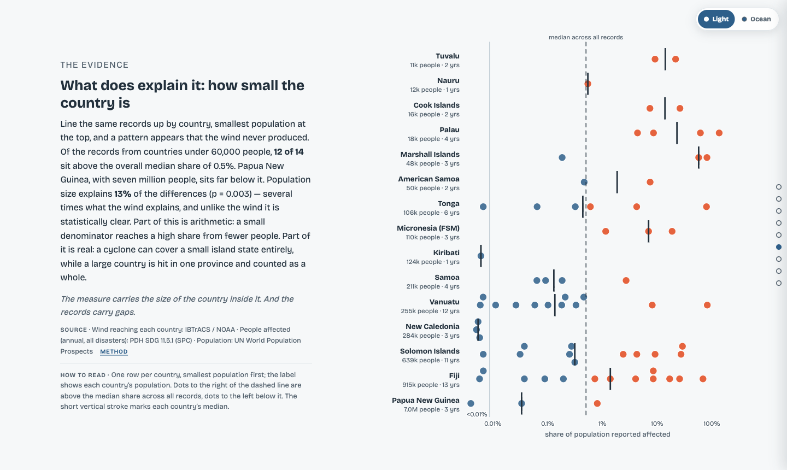
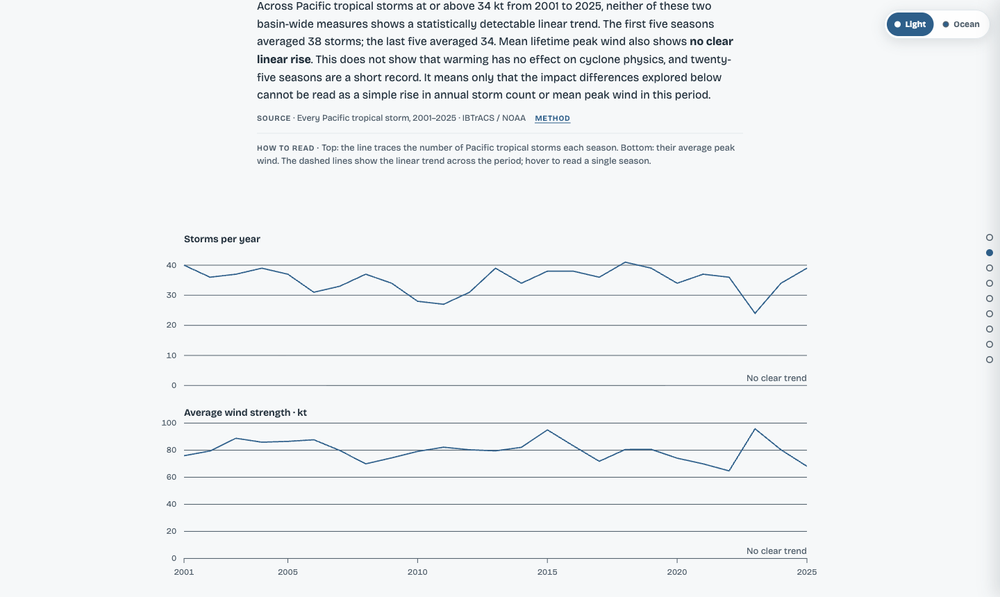
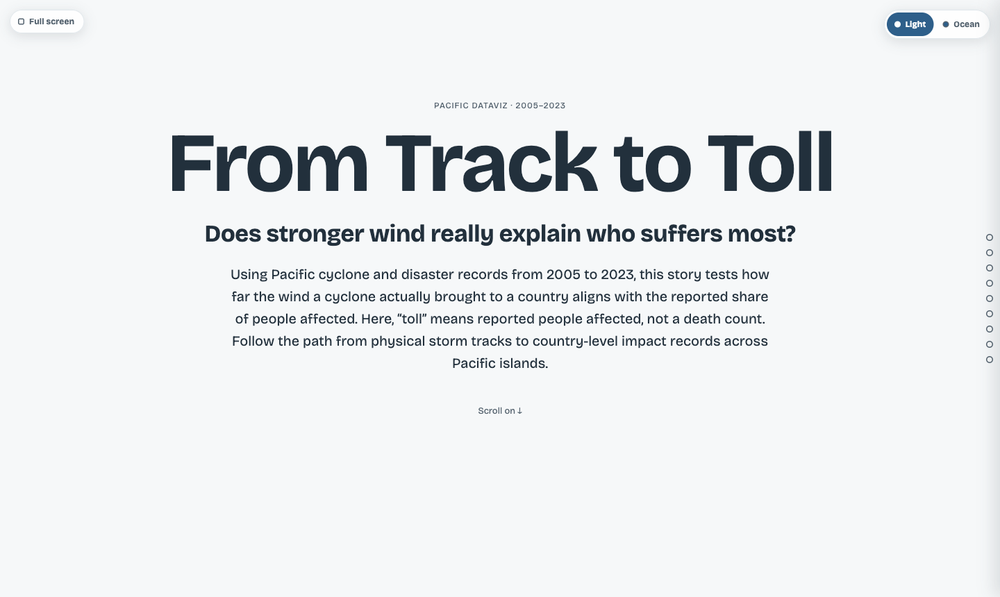

# From Track to Toll

**Does stronger wind really explain who suffers most?** An interactive D3 data story about tropical cyclones and reported human impact across Pacific island states, 2005 to 2023.

[](https://ozeanvisualisierung.yannik-h-huber.de)
[](https://github.com/41yannik/Ocean-Data-Visualisation/actions/workflows/deploy.yml)


**[Open the live visualisation](https://ozeanvisualisierung.yannik-h-huber.de)**



## What it shows

The story links physical storm tracks to country-level impact records. It tests how far the wind a cyclone actually brought to a country lines up with the share of people reported affected. The finding: wind explains little. Country size explains several times more. Of the records from countries under 60,000 people, 12 of 14 sit above the overall median share. Population size explains 13 % of the differences (p = 0.003).

The page has three parts:

- **Guided story:** a scrollytelling narrative from storm tracks to impact records.
- **Evidence Lab:** freely filterable views of the same data.
- **Data & methods:** a public provenance section with every source, transformation and limitation.

| Storm trends 2001 to 2025 | Opening |
|---|---|
|  |  |

## Highlights

- **Reproducible pipeline:** a Python pipeline turns raw source data into JSON artefacts. `meta.json` records the source catalogue, transformations, story evidence, Git state and SHA-256 checksums.
- **Publication gate:** `npm run build:public` only builds when every source is open or permissioned and fully verified. A leak guard blocks restricted fields permanently.
- **Tested end to end:** unit tests, pipeline tests and a Playwright browser audit.
- **Honest limits:** the page states what the data cannot prove (see below).

## Tech stack

D3 v7 · Vanilla JS · Vite · Python (pandas, NumPy, SciPy) · Playwright · GitHub Actions and GitHub Pages

## Data sources

| Source | Used for | License |
|---|---|---|
| [SPC / Pacific Data Hub, SDG 11.5.1](https://pacificdata.org/data/dataset/sustainable-development-goals-sdg) (`VC_DSR_AFFCT`) | Annual people affected per country | Open (PDH) |
| [SPC / Pacific Data Hub, Climate Change Indicators](https://pacificdata.org/data/dataset/climate-change-indicators-df-climate-change) (`SST_ANOM`) | Sea surface temperature anomalies | Open (PDH) |
| [IBTrACS v04r01, NOAA/NCEI](https://www.ncei.noaa.gov/products/international-best-track-archive) | Tracks, intensity, categories, R34 radii, seasonal trends | US government work |
| [UN World Population Prospects 2024](https://population.un.org/wpp/) | Population normalisation | CC BY 3.0 IGO |
| [Natural Earth via world-atlas](https://github.com/topojson/world-atlas) | 110m base map | Public domain |

Storm linkage: for each country and year, the strongest IBTrACS storm whose track passed within 500 km of the country centroid. Details per file: [`data/SOURCES.md`](data/SOURCES.md).

## Run locally

Requirements: Node.js 20+, Python 3 with pandas, NumPy and SciPy. The generated artefacts are checked in, so the frontend runs without a pipeline run.

```bash
cd project/app
npm ci
npm run dev
```

Reproduce and test:

```bash
cd project
python3 scripts/build_track_to_toll.py   # reads ../data, writes app/public/data
cd app
npm run check                            # unit + pipeline tests + build
npm run test:browser                     # Playwright audit
npm run build:public                     # gated public build
```

## Project structure

```
.
├── project/
│   ├── app/       # Vanilla JS / Vite / D3 frontend (deployed to GitHub Pages)
│   ├── scripts/   # Python data pipeline
│   └── tests/     # unit, pipeline and Playwright checks
├── data/          # raw source data + SOURCES.md (provenance and licenses)
└── short paper/   # short paper, screen recording, problem statement
```

## What the visualisation does not claim

It does not prove causal vulnerability. The affected counts are annual totals across all disasters, not storm-specific. Reported impacts are incomplete. Peak wind differs from local wind at landfall, and a missing value does not mean zero people affected.

## Context

Built for the **Pacific Dataviz Challenge 2026**. The submission meets the challenge rules: official PDH datasets, only open supplementary data, every dataset cited, English interface, and AI tools used in a supporting role only (disclosed in the short paper). Problem statement: [`short paper/problem-statement-EN.md`](short%20paper/problem-statement-EN.md).

## Author

**Yannik Huber** · [Website](https://yannik-h-huber.de) · [LinkedIn](https://www.linkedin.com/in/yannik-huber/)

## License

Code: [MIT](LICENSE). The data in `data/` keeps its original licenses, listed above and in [`data/SOURCES.md`](data/SOURCES.md).
