# Visualisierungsmöglichkeiten — je Thema erläutert & dargestellt

> Für jedes Thema aus [KONZEPT.md §4](../KONZEPT.md): **Datengrundlage** (echte Werte), **was man sieht**, das **Encoding** (Kanal → Datenfeld) und eine **Vorschau aus den echten Daten** (statischer Snapshot dessen, was die interaktive D3-Version zeigen würde). Alle Grafiken wurden mit `scripts`/pandas+matplotlib direkt aus `Data/` gerendert (`docs/mockups/`).
>
> Score = Gesamteignung (0–100), Aufwand = Umsetzungsaufwand in D3.

---

## 🌀 Cluster A — Zyklone & Sturmgefahr

### ① Storm Highways of the Pacific — Zyklonbahnen auf animiertem Globus · Score 78 · hoch
**Datengrundlage:** IBTrACS SP+WP — 2.483 Stürme (Satelliten-Ära 1980–2026), 6-stündliche Positionen; LAT/LON/SEASON/USA_SSHS zu ~100 % gefüllt.
**Was man sieht:** Zwei „Sturm-Autobahnen" — der Westpazifik (oben, Guam/Palau/Marianen) und der Südpazifik (unten, Fiji/Vanuatu/Tonga). Die weißen Punkte sind die Inselstaaten: viele liegen mitten im dichtesten, dunkelsten (= stärksten) Bahnbündel.

| Kanal | Datenfeld |
|---|---|
| Position (Pfad) | LAT / LON (Track-Geometrie) |
| Farbe | USA_SSHS (Saffir-Simpson-Kategorie) |
| Zeit (Animation) | SEASON / ISO_TIME |
| Bewegung / Schweiflänge | STORM_SPEED |

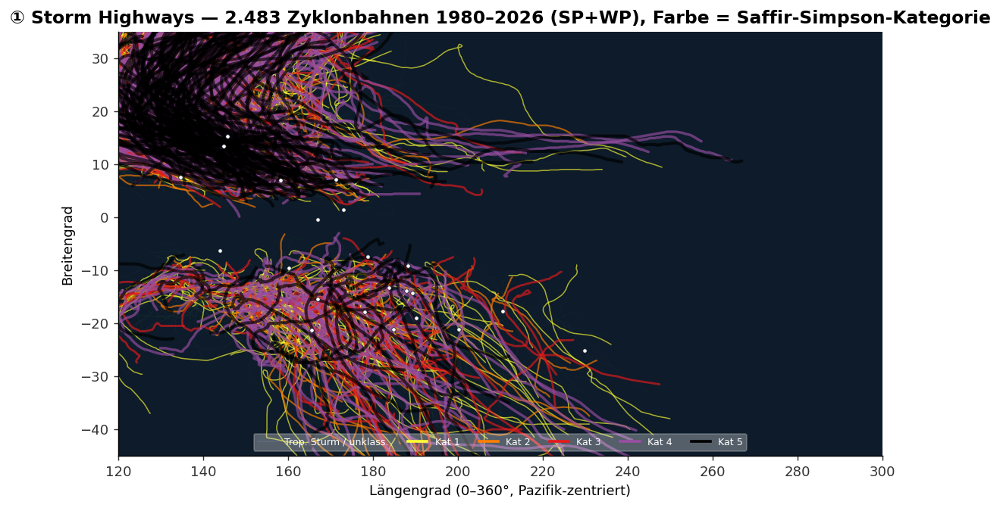

**In D3:** `d3.geoOrthographic` als drehbarer Globus; Tracks als getaperte Pfade, wandernde Sturmköpfe, Saison-Scrubber, Klick auf Insel → deren Treffer-Historie. Die statische Karte hier ist die „abgewickelte" Fassung davon.
**⚠️ Fallstrick:** Längengrad-Konventionen mischen sich (−180…242) → vor `geoClipAntimeridian` auf 0–360 normalisieren; Windradien-Fußabdruck weglassen (nur ~8 % Daten).

---

### ② From Track to Toll — sagt Sturmstärke den Schaden voraus? · Score 74 · mittel
**Datengrundlage:** `emdat_pacific_storms_events` — 48 Ereignisse mit gemeldeter Intensität (km/h) **und** Betroffenenzahl; Tote/Schaden als Zusatzkanäle.
**Was man sieht:** **Keine** saubere Diagonale — ein 185-km/h-Sturm (*Maila*) traf 350.000 Menschen, der stärkste (*Mawar*, ~295 km/h) nur ~700. Genau dieser „Rest" ist die Geschichte: **Verwundbarkeit, nicht Windstärke, entscheidet den menschlichen Schaden.**

| Kanal | Datenfeld |
|---|---|
| x-Position | Max. Windgeschwindigkeit (Intensität) |
| y-Position (log) | Betroffene Personen |
| Punktgröße | Sachschaden (USD) |
| Farbe | Tote |

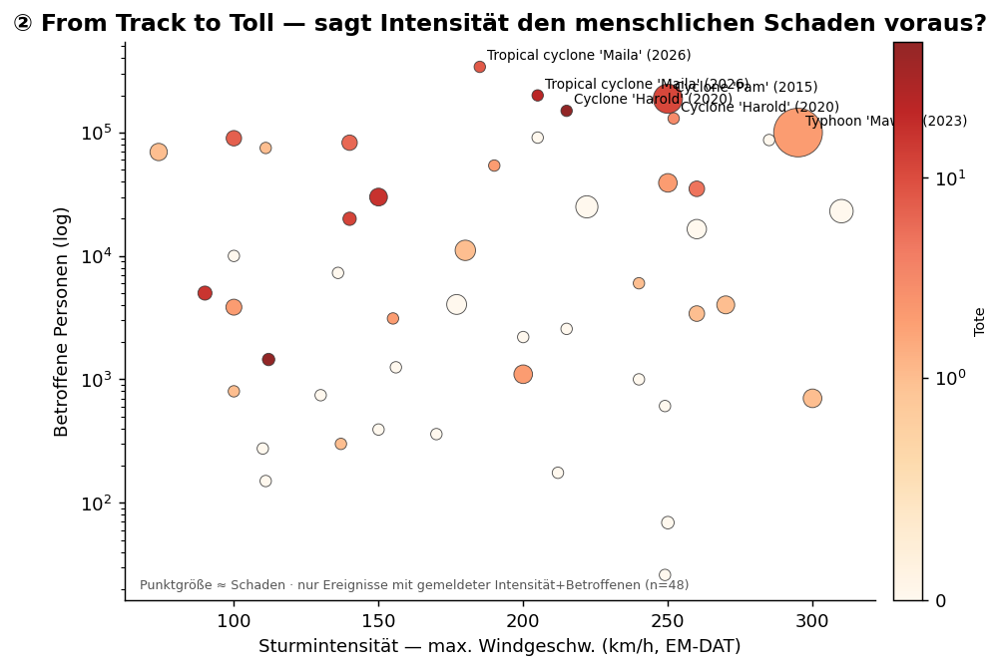

**In D3:** Coordinated Views — dieser Scatter gebrusht gegen die IBTrACS-Trackkarte (①) und einen Länder-Balken; benannte Ausreißer annotiert. **Ideale Detailansicht zu ①.**
**⚠️ Fallstrick:** Karte aus IBTrACS zeichnen (EM-DAT hat nur bei 2/99 Koordinaten); Intensität besser via Namens+Saison-Join zu IBTrACS-Spitzenwind statt EM-DAT-`magnitude`.

---

### ③ A Century of Storms — Saisonalität, Bias-ehrlich · Score 55 · mittel
**Datengrundlage:** IBTrACS SP+WP, Sturmzahl je Saison 1900–2025.
**Was man sieht:** Der scheinbare „Anstieg" der Sturmzahl ist **großteils Beobachtungsfortschritt** — die graue Fläche (vor 1970, keine Satelliten) ist systematisch untererfasst. Das Thema macht diese Datenfalle explizit zum Gegenstand.

| Kanal | Datenfeld |
|---|---|
| x | Saison (Jahr) / Monat |
| Höhe | Sturmanzahl / Dichte |
| Facette | Becken SP vs. WP |
| Schattierung | Beobachtungs-Ära |

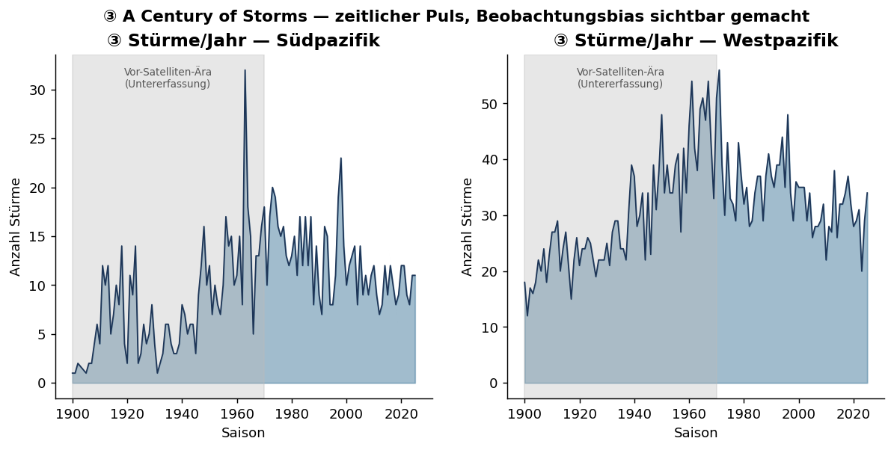

**In D3:** Ridgeline/Horizon-Small-Multiples pro Dekade; Ära-Schattierung markiert verlässliche Zeiträume.

---

## ⚖️ Cluster B — Klimagerechtigkeit

### ④ Climate-Justice Ledger — wenig emittiert, viel gelitten · Score 66 · mittel
**Datengrundlage:** GHG pro Kopf × Katastrophen-Betroffene (2005–2023, /Bevölkerung) — verknüpft über einen selbstgebauten **ISO3↔GEO_PICT-Crosswalk**.
**Was man sieht:** Die meisten Pazifikstaaten sitzen links (winzige Emissionen), streuen aber über die gesamte Schadens-Achse. **Palau** (rechts) ist der einzige echte Hoch-Emittent — die vom Faktencheck korrigierte Wahrheit (nicht Nauru).

| Kanal | Datenfeld |
|---|---|
| x (log) | GHG-Emissionen pro Kopf |
| y (log) | Betroffene pro Kopf |
| Blasengröße | Wirtschaftsschaden (USD) |
| Farbe | Subregion |

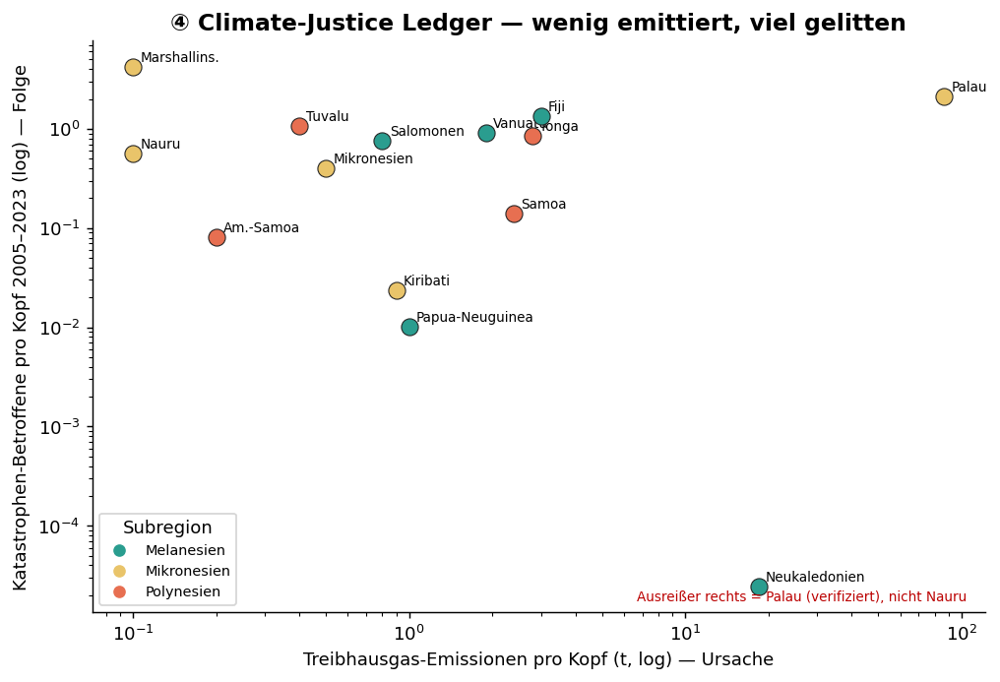

**In D3:** Quadranten-Scatter mit markierter „wenig-emit / viel-leidend"-Zone, Jahr-Brush, Hover-Tooltips.
**⚠️ Fallstrick:** n=12 Länder ehrlich benennen; Palau (nicht Nauru) als Ausreißer; absoluten Schaden neben Pro-Kopf zeigen.

---

## 🌊 Cluster C — Ozean-Klimasignal

### ⑤ Meridian Ribbon — breitengrad-sortierte SST-Heatmap · Score 58 · mittel
**Datengrundlage:** SST-Anomalie, 21 Länder × Jahre (hier 1950–2025), nach Breitengrad geordnet.
**Was man sieht:** Ein **kohärentes basinweites Warmsignal** — die gesamte Spalte kippt nach ~2000 von blau (kühler) auf rot (wärmer). Als vertikale Streifen sichtbar, weil das Signal über alle Breiten gleichzeitig wirkt (Cross-Country r≈0,60; Regen wäre inkohärent, r≈0,10).

| Kanal | Datenfeld |
|---|---|
| x | Jahr |
| y (sortiert) | Land nach Breitengrad |
| Farbe (divergierend) | SST-Anomalie |
| (2./3. Panel) | Regen- / Meeresspiegel-Anomalie |

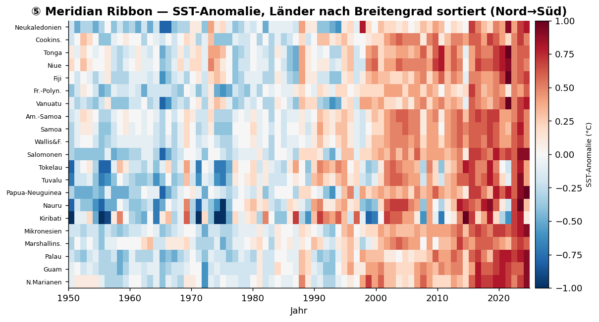

**In D3:** Gestapelte Heatmaps mit gemeinsamer Zeitachse; horizontaler Brush → synchrone Detail-Linie; ENSO-Jahre annotiert.

---

### ⑥ 175-Jahre Warming Stripes — SST-Rückgrat · Score 45 · niedrig
**Datengrundlage:** Mittlere pazifische SST-Anomalie 1850–2025 (längste Reihe im Bestand).
**Was man sieht:** Der klassische „Warming-Stripes"-Verlauf — von überwiegend blau (19./20. Jh.) zu durchgehend rot (21. Jh.).

| Kanal | Datenfeld |
|---|---|
| x / Streifen | Jahr |
| Farbe | SST-Anomalie |

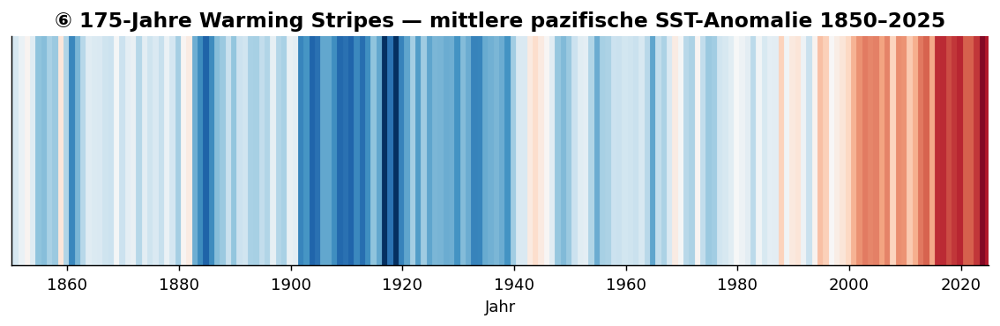

**In D3:** Als **Erzähl-Intro / Hintergrundschicht** eines Scrollytellings — nicht als eigenständige Abgabe (0,1 °C-Quantisierung, Einzelquelle).

---

### ⑦ Islands Between Two Anomalies — bivariat Regen × SST · Score 52 · mittel
**Datengrundlage:** SST- und Regen-Anomalie je Land (Mittel 2010+), an geografischen Zentroiden platziert.
**Was man sieht:** Jede Insel bekommt eine Mischfarbe aus zwei Klima-Achsen. Dunkle Punkte = doppelt gestresst (warm **und** regenauffällig).

| Kanal | Datenfeld |
|---|---|
| Farbachse 1 | SST-Anomalie |
| Farbachse 2 | Regen-Anomalie |
| Position | Zentroid (Karte) |
| Zeit | Jahr-Scrubber |

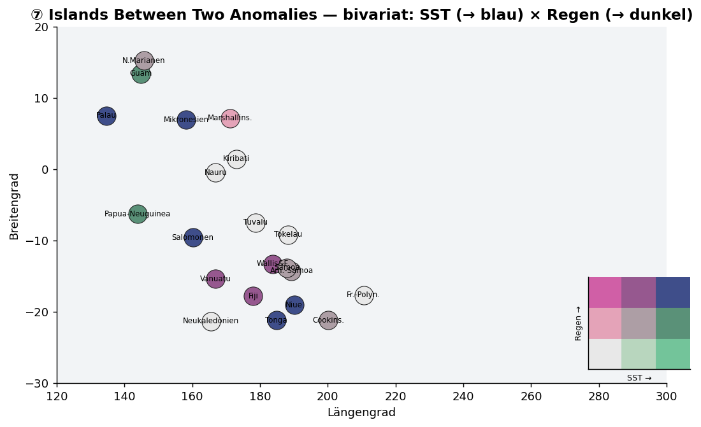

**In D3:** Bivariate Choropleth / Dorling-Kartogramm (Inseln sind winzig) mit 3×3-Legende.

---

## ⚡ Cluster D — Energiewende

### ⑧ The Uneven Energy Transition — Wer entkommt dem Diesel? · Score 63 · mittel
**Datengrundlage:** Power generation (disaggregiert), 18 Länder, volle Abdeckung 2000–2023; Quellen zu 4 Familien gruppiert.
**Was man sieht:** Der Kontrast der Strommixe — Fiji stark wasserkraftgestützt, Neukaledonien fossil-dominiert. Zeigt, wer real dekarbonisiert und wer auf importiertem Diesel sitzenbleibt.

| Kanal | Datenfeld |
|---|---|
| x | Jahr |
| Stapelhöhe | Erzeugung (GWh) |
| Farbe | Energiequelle-Familie |
| Facette | Land |

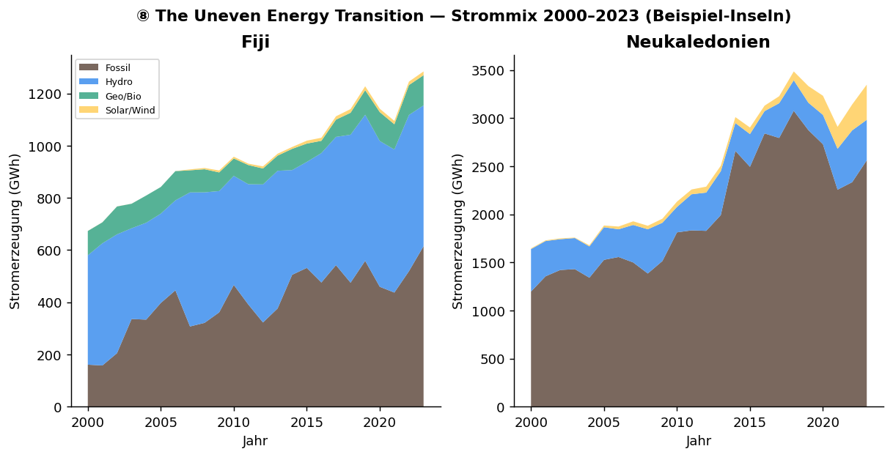

**In D3:** Sortierbares Slopegraph (Erneuerbaren-Rang) + normierte Stacked-Area-Small-Multiples; Hover für On/Off-Grid.
**⚠️ Fallstrick:** RENTOT/NRENTOT sind Subtotale (nicht stapeln); schwächster Ozean-Bezug → als Mitigations-Gegenkapitel positionieren.

---

## 🐠 Cluster E — Biodiversität

### ⑨ Silent Extinctions — Artensterben trotz mehr Schutz · Score 70 · mittel
**Datengrundlage:** Red List Index × Fischerei-Management-Abkommen, 22 Länder, 659 Land-Jahre.
**Was man sieht:** **Jede** Länder-Spur läuft nach rechts-unten: mehr Abkommen (Aufwand →), trotzdem sinkender Red List Index (Biodiversität ↓). Die „Aufwand rauf, Ergebnis runter"-Spannung ist im Bestand real und hält dem Faktencheck stand.

| Kanal | Datenfeld |
|---|---|
| x | Fischerei-Abkommen (kumuliert) |
| y | Red List Index |
| Farbe / Trail | Land über Zeit |
| Blasenfarbe (opt.) | Landbedeckungs-Index |

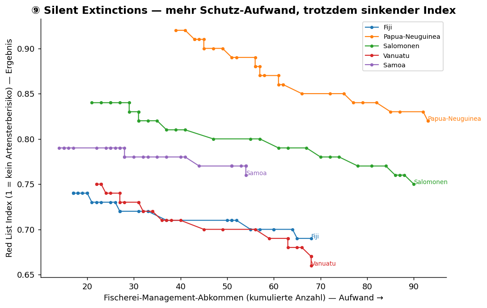

**In D3:** Connected-Scatter mit animierten Zeit-Trails, Referenzpfeil „Aufwand sollte Index heben", RLI-Achse auf realen Bereich (0,36–0,95) gezoomt.
**⚠️ Fallstrick:** Fischerei-Zahl ist kumulativ (nicht Qualität); Kausalität nur als Nebeneinanderstellung.

---

## 📊 Cluster F — Multi-SDG-Portrait

### ⑩ Pacific Lives Ledger — Verwundbarkeits-Profil je Insel · Score 60 · mittel
**Datengrundlage:** 6 SDG-Indikatoren (Wasser, TB, Erneuerbare, RLI, Meeresspiegel, Betroffene) normiert 0–1; 19/22 Länder mit vollständigem Profil.
**Was man sieht:** Ein „Fingerabdruck" je Insel — die Form zeigt sofort, wo eine Insel stark (außen) oder verwundbar (innen) ist. Vergleich über Small-Multiples.

| Kanal | Datenfeld |
|---|---|
| Radiale Achse | 6 SDG-Indikatoren |
| Radiale Länge | normierter Wert (0–1) |
| Glyph-Größe | Bevölkerung |
| Farbe | Subregion |

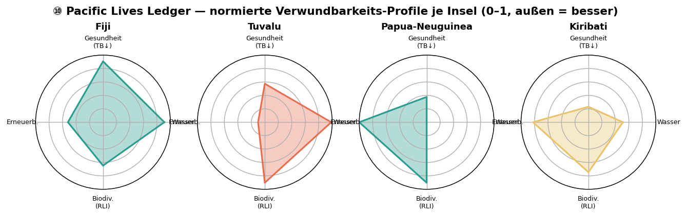

**In D3:** Sortierbare Radar-Glyphen + verknüpfter Ranking-Balken + Methodik-Note; 2–3 Snapshot-Jahre statt Flacker-Animation.
**⚠️ Fallstrick:** Composite-Score als „Meinung" deklarieren; „22 vollständig" → real 19.

---

## 👥 Cluster G — Bevölkerungsexposition

### ⑪ People Meets Storms · Score 50 · mittel
**Datengrundlage:** UN-Bevölkerung 1950–2023 + `emdat_pacific_storms_events` (2001–2026, Betroffene).
**Was man sieht:** Wachsende Inselbevölkerungen (Linien) überlagert mit Sturm-Ereignissen (Punkte, Größe = Betroffene) — die Frage, ob der Schaden mit der Demografie wächst.

| Kanal | Datenfeld |
|---|---|
| x | Jahr (ehrlich 2001–2023) |
| Linienhöhe | Bevölkerung |
| Punktgröße | Betroffene pro Sturm |
| Facette | Land |

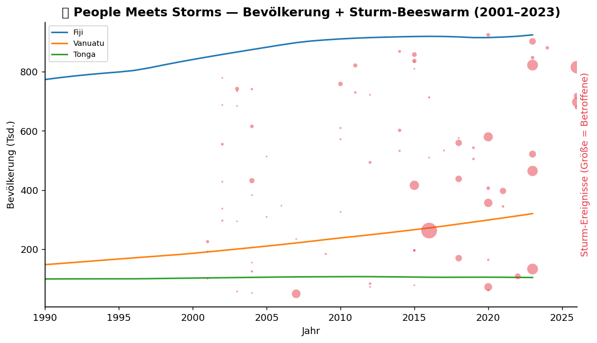

**In D3:** Horizon-Small-Multiples + synchronisierter Sturm-Beeswarm + gebrushtes Detail-Panel; echte Ozean-Anomalie als 5. Kanal ergänzen.
**⚠️ Fallstrick:** „Jahrhundert der Stürme" ist real nur 2001–2026; degenerierte Subtyp-Dimension weglassen.

---

## Fazit
Am tragfähigsten (Daten + Aussage + Machbarkeit): **① + ② kombiniert** (Sturm → Wirkung auf dem Globus), gefolgt von **⑨ Silent Extinctions** und **④ Climate-Justice Ledger** — siehe Shortlist in [KONZEPT.md §5](../KONZEPT.md). Die statischen Vorschauen hier belegen, dass die Daten jede dieser Aussagen tatsächlich tragen.
</content>
